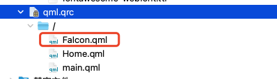

# qt-qml-fontawesome

在QML中使用Font Awesome图标

## 步骤

### 将fontawesome-webfont.ttf文件添加至项目中


### 加载字体文件

```qml
QFontDatabase fontDatabase;
if (fontDatabase.addApplicationFont(":/fontawesome-webfont.ttf") == -1)
    qWarning() << "Failed to load font ttf";
```

### 将FaIcon添加至项目中



### 在QML中使用FaIcon

```qml
FaIcon {
    name: '\uf114'
    size: 28
    color: "#252525"
}
```

*name: Font Awesome 对应的unicode*

*size: 图标大小*

*color: 图标颜色*

## fontawesome-webfont.ttf为Font Awesome 4.7，如需加载其他版本的Font Awesome或者字体图标库，请修改FaIcon的font.family属性